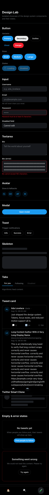
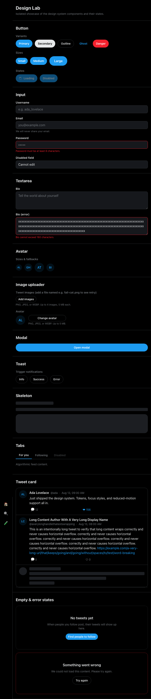
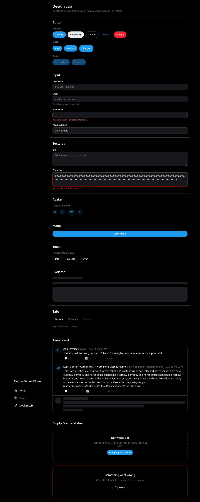

# Design system & component lab (TSC-UX-001)

Defines the reusable visual language for the frontend and an in-app component
interaction lab where every component can be reviewed in isolation before
feature pages are built on top of it.

> **Human review gate:** the visual direction (dark, X-inspired palette) and
> the core interactions below are pending human approval before feature tasks
> consume them.

## Design tokens

All tokens live in [`frontend/src/index.css`](../frontend/src/index.css) as
Tailwind v4 `@theme` variables — utilities like `bg-surface`, `text-brand`,
`rounded-card` come straight from there. Change a token once and every
component updates.

| Token group | Variables | Purpose |
| --- | --- | --- |
| Brand & feedback | `brand`, `brand-hover`, `brand-soft`, `danger`, `danger-hover`, `success` | Primary actions, destructive actions, success feedback |
| Surfaces & text | `canvas`, `surface`, `surface-hover`, `border`, `foreground`, `muted` | Dark theme backgrounds, borders, and text |
| Typography | `font-sans`, `text-xs` … `text-2xl` | Inter-first system font stack and scale |
| Radii | `radius-card` (1rem), `radius-control` (0.5rem) | Cards vs. form controls |
| Motion | `transition-fast` (150ms), `transition-normal` (200ms) | Subtle state transitions |

Base styles in the same file set dark `color-scheme`, heading scale, and a
**visible focus ring** (`:focus-visible`, 2px brand outline) on every
interactive element. A global `prefers-reduced-motion: reduce` media query
clamps all animations/transitions, and animated utilities additionally use
`motion-reduce:` variants.

## Components

All in [`frontend/src/components/`](../frontend/src/components). Import UI
primitives from `src/components/ui` (barrel `index.ts`).

| Component | States / variants | Accessibility notes |
| --- | --- | --- |
| `Button` | `primary` `secondary` `outline` `ghost` `danger`; `sm` `md` `lg`; `loading`, `disabled` | Loading sets `aria-busy` + disables; keyboard-activatable |
| `Input` / `Textarea` | default, `hint`, `error`, `disabled` | Always labelled (`htmlFor`); errors set `aria-invalid` and are linked via `aria-describedby` with `role="alert"` |
| `Avatar` | `sm` `md` `lg`; image or initials fallback | Falls back to initials on missing/failed image; always has an accessible name |
| `Modal` | open/closed | `role="dialog"` + `aria-modal`, focus moves in on open and is restored on close, Tab is trapped, Escape/backdrop closes |
| `Toast` (`ToastProvider` + `useToast`) | `info` `success` `error`, auto-dismiss (5s), manual dismiss | `role="status"` (polite) for info/success, `role="alert"` for errors |
| `Skeleton` | block placeholder, optional `label` | `aria-hidden` when decorative; `role="status"` when labelled; pulse disabled under reduced motion |
| `Tabs` | active/inactive/disabled tabs | WAI-ARIA tablist pattern: roving tabindex, ArrowLeft/Right/Home/End with automatic activation, `aria-selected`/`aria-controls`/`aria-labelledby` wiring |
| `TweetCard` (+ `TweetCardSkeleton`) | loaded, loading skeleton, long content | `<article>` with accessible label; action buttons have count-inclusive `aria-label`s; `break-words` prevents overflow |
| `EmptyState` | title, optional description, optional action | Centered dashed placeholder |
| `ErrorState` | title, description, optional `onRetry` | `role="alert"`; retry via `Button` |
| `AppShell` | responsive layout | Skip link to `#main-content`; uniquely-labelled nav landmarks (`Primary`, `Primary mobile`) |

### Responsive behavior

`AppShell` implements the product breakpoints
(mobile `<640px`, tablet `640–1024px`, desktop `>1024px`):

- **Mobile:** sticky top header + fixed bottom icon navigation.
- **Tablet:** icon-only left sidebar.
- **Desktop:** full sidebar with labels.

## Component lab

The lab is an in-app development route at **`/lab`**
([`frontend/src/routes/Lab.tsx`](../frontend/src/routes/Lab.tsx)) — no extra
framework or external tool. It renders every component in its representative
states (default, loading, disabled, error, empty, and long content). Run it
with `npm run dev` and open <http://localhost:5173/lab>.

### Screenshots (Playwright, full page)

| Mobile (375px) | Tablet (768px) | Desktop (1280px) |
| --- | --- | --- |
|  |  |  |

Regenerate with `npm run e2e` (see
[`frontend/e2e/lab.spec.ts`](../frontend/e2e/lab.spec.ts)).

## Quality checks

- **Unit/component tests** (Vitest + React Testing Library):
  `frontend/tests/components/` + `frontend/tests/Lab.test.tsx` — 60 tests
  covering rendering, states, keyboard navigation (tabs arrows/Home/End,
  modal focus trap/Escape/focus restore), and toast behavior.
- **Automated accessibility:** every component and the full lab page are
  checked with `jest-axe` (`axe-core`) — all report zero violations.
- **Responsive e2e:** `frontend/e2e/lab.spec.ts` asserts no horizontal
  overflow at 375/768/1280px (before and after scrolling) and verifies that
  `prefers-reduced-motion: reduce` clamps transition durations.

Commands: `npm run test`, `npm run test:coverage`, `npm run e2e`,
`npm run lint`, `npm run typecheck`, `npm run format:check`.
